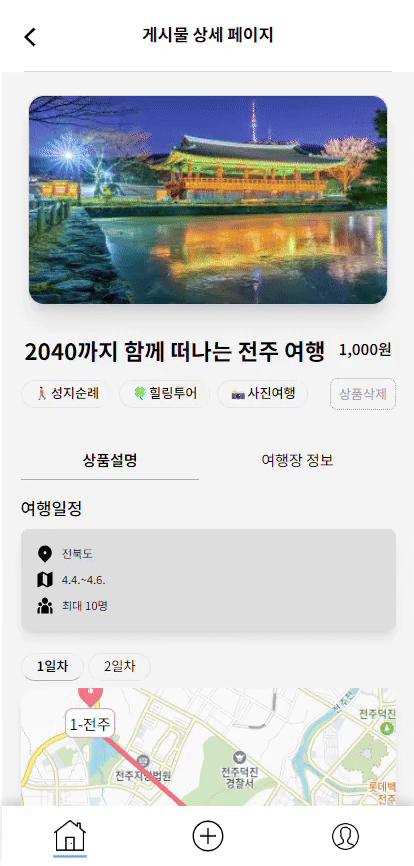

## 📎 목차

1. [프로젝트 팀 소개](#-프로젝트-팀-소개)
2. [프로젝트 소개](#-프로젝트-소개)
3. [기술 스택](#-기술-스택)
4. [컨벤션](#-컨벤션)
5. [담당 페이지 및 기능](#-담당-페이지-및-기능)
6. [주요 기능 및 코드](#-주요-기능-및-코드)
7. [화면 구성](#-화면-구성)
8. [추가하고싶은 페이지 및 기능](#-추가하고싶은-페이지-및-기능)
9. [프로젝트 소감](#-프로젝트-소감)

---

<br>

## 😀 프로젝트 팀 소개

<b>1조 원더독(onederdog)</b>
| [박지민(팀장)](https://github.com/aksenmi) | [류채영](https://github.com/chaeyoungg) | [양준호](https://github.com/yanggengjelly) | [김도하](https://github.com/D0-HA) |
| :---------------------------------------------------------------------------------------------------------------------------------------: | :---------------------------------------------------------------------------------------------------------------------------------------: | :---------------------------------------------------------------------------------------------------------------------------------------: | :---------------------------------------------------------------------------------------------------------------------------------------: |
|  |  |  |  |

---

## 📑 프로젝트 소개

뻔한 여행지는 그만,
나만의 여행 코스를 공유하고 함께 가자~!
여행 동행 메이트 구하기 <b>Trip with me🛫</b>
<br>

🔗<b>배포 URL :</b> [trip-withme.netlify.app/](https://trip-withme.netlify.app/)
<b>테스트 계정</b> <b>ID :</b> testApp@test.com / <b>PW :</b> 11111111
<br>

📆 전체 프로젝트 기간 : 2024.04.01 ~ 2024.04.24

- 04.01 ~ 04.07 : 컨셉 기획, 초기 UI 설계 및 프로젝트 세팅
- 04.08 ~ 04.23 : 기능 구현
- 04.23 ~ 04.24 : 코드 리팩토링 및 UI 디자인 세부 조정

---

## ⚙️ 기술 스택


 
 

<br>

### Library


 


### Tools


  


### Setting

 

### Package Manager

  

---

## 📢 컨벤션

### Git

```JavaScript
Feat (타입) : 로그인 기능 구현 (제목)

- 새로고침 시 로그인 유지 기능 개발 (본문)


// 타입 참고
Feat : 새로운 기능을 추가한 경우
Fix : 버그를 고친 경우
Design : 사용자 UI 디자인
Style : 코드 포맷 변경, 세미 콜론 누락 등 코드 수정이 없는 경우
Comment : 주석 추가 및 변경
Docs: 문서를 수정한 경우
Chore : 패키지 매니저 설정
Refactor : 코드 리팩토링
Rename : 파일, 폴더명을 수정하거나 옮기는 작업만 수행한 경우
Remove : 파일을 삭제하는 작업만 수행하는 경우


// 본문 참고
- 선택사항이므로 모든 커밋에 작성할 필요 없음
- 부연 설명이 필요하거나 커밋 이유를 설명할 경우 작성
- 72자 제한
- 무엇을 왜 변경했는지에 맞춰서 작성
```

<br>

### Code

```JavaScript

```

---

## ✨ 담당 페이지 및 기능

<b>박지민</b>

- 상품 등록 페이지

  - 상품명, 인원, 가격, 여행 테마 설정 기능
  - 지도 API 활용하여 일자별 여행 동선 마킹 및 그리기 기능
    <br>

- 상품 상세 정보 페이지

  - 상품 상세 정보 렌더링(Kakao Map API)
  - 상품 삭제 기능
  - 여행장 정보 탭
    - 여행장 프로필 렌더링

<br>
<b>류채영</b>

- 회원가입 페이지
- 로그인 페이지

  - 로그인 세션, 토큰 관리(zustand)
    <br>

- 상품 상세 정보 페이지

  - 여행장 정보 탭

    - 여행장이 받은 후기 목록 렌더링

    <br>

- 마이페이지

  - 사용자의 프로필 렌더링(타유저 포함)
  - 회원 정보 수정 기능
    <br>

- 찜 목록 페이지

  - 찜한 상품 목록 렌더링
    <br>

- 구매 목록 페이지

  - 구매한 상품 목록 렌더링
  - 구매한 상품의 여행장에 대한 후기 작성 기능
    <br>

- 상품 찜하기 기능
- 상품 예약하기 기능

<br>
<b>양준호</b>

- 시작 화면

  - 서비스에 대한 설명 슬라이드
    <br>

- 상품 등록 페이지

  - 상품 이미지, 일정(react-calendar), 여행 지역 설정 기능
    <br>

- 상품 상세 정보 페이지

  - 상품 상세 정보 렌더링
  - 상품 삭제 기능
  - 댓글 등록, 수정, 삭제 기능

<br>
<b>김도하</b>

- 메인 페이지

  - 찜 횟수 높은 상품 슬라이드로 렌더링
  - 최신 상품 목록 렌더링
    <br>

- 검색 페이지

  - 키워드 검색 기능
  - 지역, 테마 필터링 검색 기능
    <br>

- 판매 목록 페이지
  - 판매한 상품 목록 렌더링

---

## 📌 주요 기능 및 코드

- 어쩌구저쩌구 기능

```JavaScript
const onederdog = "어쩌구저쩌구";
```

---

## 📲 화면 구성

|                    시작화면                     |                      회원가입                      |                    로그인 - 메인페이지                     |
| :---------------------------------------------: | :------------------------------------------------: | :--------------------------------------------------------: |
|  |  |  |

|                키워드/필터링 검색                 |                      게시물 상세                      |                     게시물 등록                      |
| :-----------------------------------------------: | :---------------------------------------------------: | :--------------------------------------------------: |
|  |  |  |

|                    게시물 등록 2                     |                      게시물 삭제                      |                     등록된 상세 게시물                      |
| :--------------------------------------------------: | :---------------------------------------------------: | :---------------------------------------------------------: |
|  |  |  |

|                      구매하기                      |                      댓글등록                       |                      찜하기                      |
| :------------------------------------------------: | :-------------------------------------------------: | :----------------------------------------------: |
|  |  |  |

|                      찜목록                      |                      판매목록                       |                      구매목록 및 후기작성                      |
| :----------------------------------------------: | :-------------------------------------------------: | :------------------------------------------------------------: |
|  |  |  |

|                     타인 페이지                      |                      회원정보 수정                       |                      로그아웃                      |
| :--------------------------------------------------: | :------------------------------------------------------: | :------------------------------------------------: |
|  |  |  |

---

## 💡 추가하고싶은 페이지 및 기능

- 어쩌구저쩌구 페이지
  - 어쩌구 저쩌한 기능

---

## 💌 프로젝트 소감

#### 박지민

```
지도를 만들어보면서 새로운걸 만드는데 있어서도 자신감도 많이 생겼고
어떻게 협업을 해야하는지 , 서버와의 통신이 어떻게 이루어지는지 잘 알게 됐습니다.
다들 잠도안가고 집도안자고 새벽이고 아침이고 열심히 해줘서 고마웠고
3주동안 즐거웠습니다~! 리팩토링 화이팅

```

#### 류채영

```
프로젝트를 진행하는 3주 동안 다양한 코드, 에러와 싸우면서 그 어느때보다 크게
성장할 수 있었다고 생각합니다. 의욕적으로 함께 달려와준 팀원들에게 감사드리며,
이제 프로젝트 진행하면서 급격히 늘은 체중은 어떻게 효율적으로 뺄지
고민해봐야겠습니다~!!!

```

#### 양준호

```
멋쟁이사차럼 프론트엔드 9기 프로젝트( Trip-with-me 1조 )를 진행하면서 제가 맡은 각 콘텐츠 부분이 밸리데이션을 거쳐 동작 되는 기능들이 많았습니다.
저희가 원하는 결과를 미리 Trip-with-me 서비스에 설정된 기준에 사용자가 맞춰
적합한 결과를 얻어냈는지까지 직접 사용자가 되어보고 불편한 것과 부족한 안내 등
어떻게 더욱 심플하게 사용자에게 사용하기 쉽게 다가갈 수 있을까 최소한의 내용으로 사용자에게 원하는 결과물을 어떻게 얻어낼까? 많은 고민을 했던 시간이였습니다.
그리고 Product 추가하는 기능구현을 하면서 많은 에러와 오류가 있었습니다..
이 부분에서 서버와 데이터에 한걸음 가까워진 거 같습니다.
저희 프로젝트 주제 처럼 같이 동행해준 1조 팀원들에게 감사드립니다. 감사합니다.

```

#### 김도하

```
협업 할 때 생길 수 있는 다양한 이슈들을 미리 겪어볼 수 있어서 좋았습니다.
많이 부족한 실력으로 프로젝트를 진행하게 되었는데,
팀원분들의 큰 도움으로 느끼고 배운 것이 많아요. 감사드립니다.
```

<br>

**[⬆️ 위로 올라갈래 ⬆️](#-목차)**
